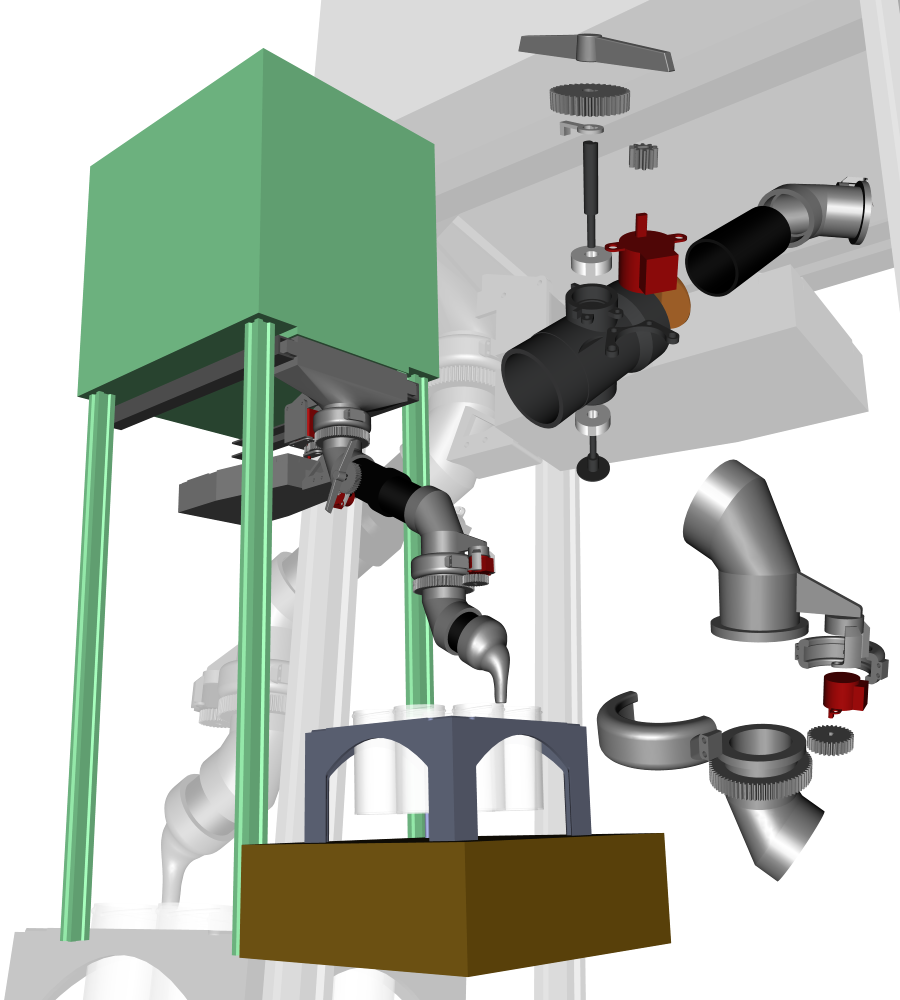

# Pellet distributor
CAD and Arduino/Python code files for the pellet distributor robot

A tutorial for using the code is available as a [Notebook](Code/Python/Pellet_distributor_py/Example_using_pellet_distributor.ipynb)

⚠ All parts are designed to be printed, if possible, according to the specified [Cura settings](Resources/Ultimaker_S5_Cura_Config.curaprofile). These include:
- Horizontal Expansion: -0.1 mm
- Initial Layer Horizontal Expansion: -0.16 mm

## Introduction to the project & current state
The pellet distributor robot is a double-jointed articulated tube designed for pellets to be distributed into a set of cups on a tray, with the aim of automating the output of the material production process:
> Mixing of desired composition 🠚 Extrusion 🠚 Cooling 🠚 Pelletizing 🠚 **SORTING** ⇨ Transport to sample manufacture & experimentation

The parts, designed in FreeCAD, are made mostly of PLA by 3D printing, together with 50mm diameter PVC pipe sections, and nuts and bolts for fastening. The robot, measuring 552x497x236mm, uses two stepper motors for positioning, one on its base and another closer to the end of the arm, allowing it to effectively sweep a truncated circular sector below the pelletizer that covers the entire area of a tray. A third stepper actuates the opening and closing of a butterfly valve.  The whole assembly is suspended beneath the pelletizer by two arms on the top funnel/hopper, inserted into aluminum railings just under where the pellets exit. These make their way through the first joint, the valve (if open), and through the second joint, before reaching the nozzle and dropping into a cup or being discarded. The tray holding the cups is set up on a scale, which enables the control of fill levels of cups, as well as determining the material yield.

The motors are controled by A4988 drivers and an Arduino Uno R3 board, which is in turn managed by a Python script on a computer. The communication between these is established through a serial protocol, hence the Arduino must be plugged in by USB during operation, in addition to the power cable for the motors. The scale is also connected by its own serial port to the script. This Python code makes use of the Inverse Kinematics Python library (IKPy), through which the number of steps that each motor needs to take can be calculated in order for the robot to move its nozzle to a desired position. This versatility in the code, together with the fact that the arm should be able to reach any point within the swept region defined above, implies that the design is theoretically adaptable to any tray and cup arrangement, as long as these fit within said area.

The way the current script works is the following: Firstly, the robot arm must be pointing completely straight and perpendicular to the face of the pelletizer, and the current 9-hole square tray, whose center is alligned with the axis of rotation of the bottom joint, is set up on the scale. Then, the scale is zeroed, the arm rotates to the first cup's coordinates, opens the valve and lets pellets through. Once the predetermined weight capacity of each cup is reached, as measured on the scale, the script knows to close the valve and move on to the next cup. It does this rotating through all 8 external cups, then finally goeas to the center cup. Once this one has been filled it returns to the initial position.

The following items are currently hard-coded into the script, hence they are accounted for but require user input if change is needed:
- Initial position of the robot arm's tip
- Position of the tray relative to the robot
- Position of each cup relative to the tray
- Occupancy state of the tray slots
- Cup fill level, material, and other properties

However, the following are addressed dynamicaly, and therefore would require no adaptation in case of future tray design and operation changes:
- Path to take in between coordinates
- Operation of the valve
- Operation of the scale
- The Arduino code as a whole

## Current issues and future development
There are, however, to problems that have been encountered with this design. First, the flexing of the mounting bracket of the top stepper motor, together with the fact that the top joint is driven by a gear train instead of a belt mechanism, means that during translation of the top arm (which currently only occurs for the 9th cup) the gears can be pushed appart under torque and disengaged by the flexing, resulting in missed rotation. Note that, since there is no feedback through the motors themselves nor through an external system such as CV, the script has no way of accounting for missed steps, or, as is the case here, a disengagement of the gear train, hence it can be mistaken about the real location of the nozzle.

A second issue is static charge. It appears that most stages of the material production process can induce it: the extrusion by the fillament rubbing at the exit; the cooling channel again by triboelectric effect due to the air sprayed over the fillament; the pelletizer also by contact, with the rollers or the casing; and even perhaps the robot tube itself once the pellets are cut, since they slide over the plastic surface. This causes problems since it allows for two things to happen: the pellets might get stuck in the tube due to attraction to the walls; and, once a cup reaches a certain fill level, the charged pellets within it act as an electric repulsor for oncoming pelles (since they all hold the same charge), pushing them away from falling into the cup and in some instances making them fly out of the cup rather dramatically. I believe that simply discharging the pellets, as has been attempted, is not a sufficient fix since they might be attracted to the discharge points (Eg: aluminum foil), creating an insulating barrier through which the rest of the pellets cannot lose their charge, hence the problem remains. The current consideration is using ionized air, as appears to be the industry consensus, to remove the pellets charge.

In light of these hurdles, and keeping the ambitions of the whole RobotLab in mind, there are some suggestions to be made for future developments regarding this project:
- Implementing Computer Vision (CV), for direct object detection as well as asisted, for instance, through ArUco markers. This could enable:
  - Knowledge of the tray's exact coordinates, removing the need for precise alignment when placing it under the robot.
  - Determining the location of each cup individually, instead of having to hard-code their coordinates relative to the tray for each existing tray design.
  - Detecting the state of the cups, such as their fill level; or if there is a problem, so that they can be skipped (Eg: Cup missing, already full, contaminated or partially containing a material different than the one currently being extruded)
  - Interaction with a separate robotic arm, that can pick up the cups and/or trays after they have been filled.
  - Vissual feedback on the robot arm's pose, which eliminates missmatch issues between the real pose and the ideal one.
- Creating a database that, interacting with the script, can cataloge the available trays, those in storage; the contents, fill level,s and properties of every cup, etc. This would be necessity if there ever is the desire to scale production, and would be useful for the transport system to interact with.

And some less impactful TO-DOs:
- Implementing tray swapping into the script, so that after operation it holds the valve closed in the initial position while a human/robot picks up the full tray and swaps in a new, empty one. This could be done either with a simple user input through consol, which would replace restarting the script, or even in a more automatic fashion by using the scale to detect negative weight when the tray has been taken out, then waiting for a slight increase corresponding to the new empty tray being placed.
- Vertically integrating the script upwards with an overarching material production control script, that manages the mixing, extrusion and pelletizing. This would not be too difficult given how the robot operation is built on a functional basis, and the management of cups and trays is object-oriented.

[> Back to top](#TOP)

## Useful links & references

- [ ] [Arduino & Breadboard wiring diagram](https://github.com/AMDatIMDEA/Pellet_sorter/blob/3199d7dc5ab3ea5f197367ed4c28cb93c2f82943/Schematics/Electronics/Pellet%20Sorter%20Arduino%20and%20Driver%20Wiring%20Drawing%20Final%20Annotated.png)

### ⚡ Stepper Motors
- [Arduino AccelStepper Class Reference](https://www.airspayce.com/mikem/arduino/AccelStepper/classAccelStepper.html)
- [Arduino AccelStepper Examples](https://www.airspayce.com/mikem/arduino/AccelStepper/examples.html)
- [A4988 Driver simplified guide](https://lastminuteengineers.com/a4988-stepper-motor-driver-arduino-tutorial/)
- [ ] [Small stepper datasheet](https://github.com/AMDatIMDEA/Pellet_sorter/blob/d0cadbf57e2ab080da146999fbca15fec0f52def/Resources/Guides_and_Datasheets/290-028-1_ts-24byj48a-25-pxw%20Stepper.pdf)
- [ ] [SX-NEMA17 Stepper datasheet](https://github.com/AMDatIMDEA/Pellet_sorter/blob/d0cadbf57e2ab080da146999fbca15fec0f52def/Resources/Guides_and_Datasheets/SX17%20NEMA17%20Stepper.pdf)
- [ ] [A4998 Driver datasheet](https://github.com/AMDatIMDEA/Pellet_sorter/blob/d0cadbf57e2ab080da146999fbca15fec0f52def/Resources/Guides_and_Datasheets/A4988-%20Driver%20Datasheet.pdf)

### 🔌 Serial port
- [Arduino Serial functions](https://www.arduino.cc/reference/en/language/functions/communication/serial/)
- [Python pySerial API Classes](https://pyserial.readthedocs.io/en/latest/pyserial_api.html)

### ⛓ Inverse Kinematics
- [IKPy GitHub Repo](https://github.com/Phylliade/ikpy)
- [IKPy Documentation](https://ikpy.readthedocs.io/en/latest/ikpy.html)

### ⚖ Balance
- [ ] [CPWplus Scale datasheet](https://github.com/AMDatIMDEA/Pellet_sorter/blob/d0cadbf57e2ab080da146999fbca15fec0f52def/Resources/Guides_and_Datasheets/CPWplus_UM_USA%20Scale.pdf)

### 🐢 TurtleBot
- [TurtleBot 4 GitHub Hardware repo](https://github.com/turtlebot/turtlebot4-hardware/tree/master/TurtleBot%204/Components)
- [ ] [TurtleBot 4 Integration Platform datasheet](https://github.com/AMDatIMDEA/Pellet_sorter/blob/c34230bc0438fd95317bfee5fad6f5a7074d98d1/Resources/Guides_and_Datasheets/TurtleBot%20Top%20Integration%20platform%20draft.pdf)

[> Back to top](#TOP)
